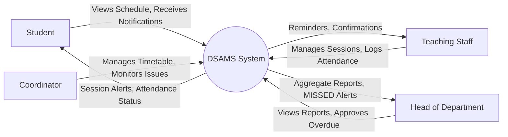
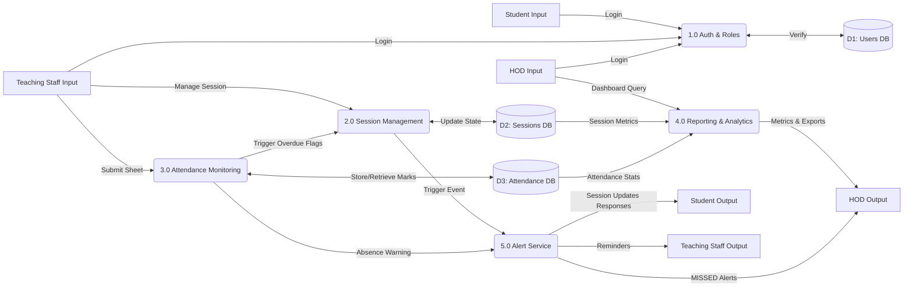

# DSAMS (Departmental Student Attendance Monitoring System) Data Flow Diagrams

This report contains the Data Flow Diagrams (DFDs) for the DSAMS project, including the Level 0 (Context) Diagram and the Level 1 Diagram. They have been designed accurately based on the system's architecture and features.

## 1. Level 0 DFD: Context Diagram

The Context Diagram provides a high-level overview of the entire DSAMS application, illustrating how external entities (users) interact with the central system without getting into internal processes.

### External Entities Description:
* **Student:** End-users who attend lectures, view their session schedules, and receive alerts upon schedule changes/cancellations.
* **Teaching Staff:** Responsible for managing session statuses (Confirm, Reschedule, Cancel), primarily preceding the lecture (0-30m window), and logging attendance data.
* **HOD (Head of Department):** Executive users who view high-level attendance reports, overview dashboard statistics, and oversee auto-confirmed missed sessions.
* **Coordinator:** Administrative users responsible for setting timetables and managing core constraints (e.g., room assignments).

---

## 2. Level 1 DFD: Internal Processes

The Level 1 DFD breaks down the core `DSAMS System` into its primary internal sub-processes, mapping out the flow of data between these processes and the persistent data stores. To prevent overlapping edge lines and maintain maximum visual clarity, interacting users have been logically split into "Input Actors" (left) and "Output Actors" (right).

### Processes:
1. **1.0 Auth & Roles:** Manages secure login, CSRF validation, and ensures users only access features permitted by their specific roles (e.g., Teaching Staff vs. HOD).
2. **2.0 Session Management:** Handles the core logic surrounding lecture sessions. Features strict state-based validation (preventing conflicting updates) and tracks status progression (`SCHEDULED` ➔ `CONFIRMED` / `CANCELLED` ➔ `MISSED`).
3. **3.0 Attendance Monitoring:** Processes the submission and approval of attendance records. Evaluates parameters for overdue session confirmations and logs actual student participation.
4. **4.0 Reporting & Analytics:** Aggregates session states and student attendance tallies to populate visual summary cards and navigable dashboard resources for executive users (like the HOD).
5. **5.0 Alert Service:** An automated background process responsible for parsing system events (e.g., a class cancellation, or 45-minute overdue warning) and dispatching timely alerts to the target user base without requiring manual intervention.

### Data Stores:
* **D1 (Users DB):** Contains centralized credentials, personal profiles, and relational mappings for System Roles.
* **D2 (Sessions DB):** Houses all metadata regarding lecture sessions (Time, Room, Course, specific Teaching Staff assigned, and Current Status).
* **D3 (Attendance DB):** Stores transactional data of individual student presence, absences, and the corresponding approval trails.
