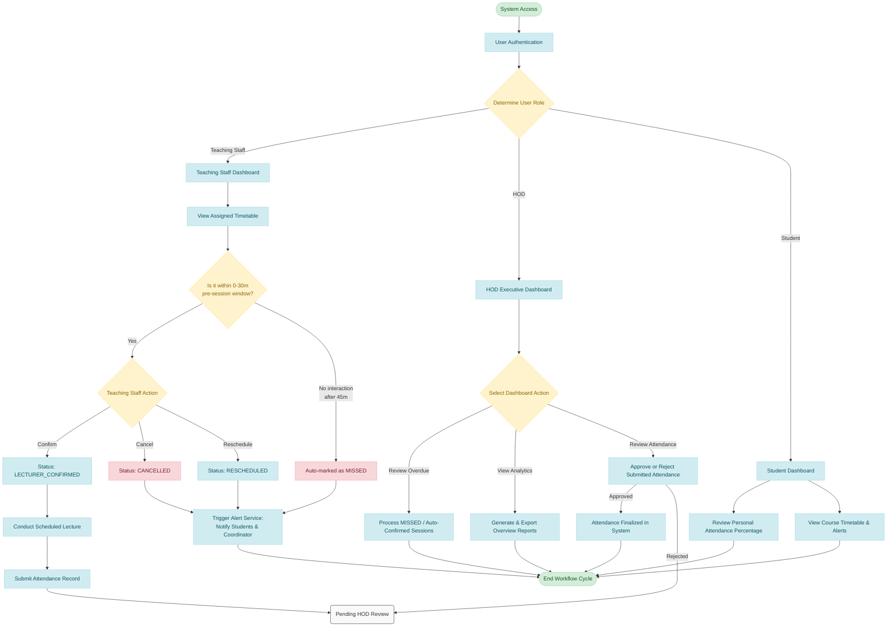

# DSAMS (Departmental Student Attendance Monitoring System) Flowchart

This report contains the core system workflow flowchart for the DSAMS project. It visualizes the step-by-step logic and decision paths based on the primary user roles (Teaching Staff, HOD, and Student) and highlights the key functionalities such as session management and attendance tracking.

## Core System Workflow Flowchart

The following diagram maps out the user journey from login through the specific workflows designated for each role.

### Flowchart Breakdown

1. **Authentication:** The workflow begins when a user logs in. The system immediately routes the user to a specific dashboard tailored to their administrative role.
2. **Teaching Staff Mechanics:** 
   * **Pre-Session Management:** Prior to a lecture, teaching staff are prompted to confirm, cancel, or propose a reschedule for the class.
   * **Automated Oversight:** If teaching staff fail to confirm a session within 45 minutes of its scheduled start time, the system will actively bypass intervention and flag the session as `MISSED`.
   * **Communication:** Any canceled, rescheduled, or missed sessions automatically trigger the **Alert Service** to warn students and dispatch updates to the HOD/Coordinator.
   * **Attendance Capture:** Only fully confirmed sessions transition to allow the capture of student attendance, which is then batched for head-of-department review.
3. **HOD Mechanics:** Head of Departments overview the generated data, focusing on resolving anomalies (missed sessions) or systematically approving finalized attendance rosters submitted by their staff.
4. **Student Mechanics:** The end-user primarily utilizes the system as a real-time monitor for their aggregated attendance rates and timetable adjustments stemming from teaching staff decisions.
