# DSAMS (Departmental Student Attendance Monitoring System) System Map

This document outlines the System Map (or Site Architecture Map) for DSAMS. While a flowchart describes chronological workflow, a System Map provides the structural blueprint of the application, organizing its features, pages, and components hierarchically by user role.

## System Architecture Blueprint

```mermaid
flowchart TD
    %% Base Level
    Root([DSAMS Root / Login Interface]):::rootNode

    %% Primary Portals
    Root --> TS_Portal[Teaching Staff Portal]:::portalNode
    Root --> HOD_Portal[Head of Department Portal]:::portalNode
    Root --> Stu_Portal[Student Portal]:::portalNode
    Root --> Admin_Portal[Coordinator / Admin Portal]:::portalNode

    %% --------------------------------
    %% Teaching Staff Sub-Architecture
    %% --------------------------------
    TS_Portal --> TS_Dash(Dashboard Overview)
    TS_Portal --> TS_Timetable(My Assigned Timetable)
        TS_Timetable -.-> TS_Confirm(Pre-Session Action Window)
        TS_Confirm --> TS_Action>Confirm / Reschedule / Cancel]
    TS_Portal --> TS_Attn(Attendance Management)
        TS_Attn --> TS_Submit>Submit Digital Record / Upload Paper]
    TS_Portal --> TS_History(Session History Log)

    %% --------------------------------
    %% HOD Sub-Architecture
    %% --------------------------------
    HOD_Portal --> HOD_Dash(Executive Analytics Dashboard)
        HOD_Dash --> HOD_Stats>Aggregate KPIs & Low Flags]
    HOD_Portal --> HOD_Review(Review Board)
        HOD_Review --> HOD_Missed>Flagged 'MISSED' Sessions]
    HOD_Portal --> HOD_Approve(Attendance Verification)
        HOD_Approve --> HOD_Sign>Approve / Reject Submitted Lists]

    %% --------------------------------
    %% Student Sub-Architecture
    %% --------------------------------
    Stu_Portal --> Stu_Dash(Student Dashboard)
        Stu_Dash --> Stu_Stats>Personal Attendance Metrics]
    Stu_Portal --> Stu_Timetable(Course Timetable)
        Stu_Timetable --> Stu_Alerts>Real-time Class Status Alerts]

    %% --------------------------------
    %% Admin / Coordinator Sub-Architecture
    %% --------------------------------
    Admin_Portal --> Admin_Users(User Configuration)
        Admin_Users --> Admin_Roles>Role Assignment & Bulk Import]
    Admin_Portal --> Admin_Sch(Scheduling Engine)
        Admin_Sch --> Admin_Params>Define Timeslots & Cohorts]
        Admin_Sch --> Admin_Rooms>Manage Rooms & Capacity]
        Admin_Sch --> Admin_Gen>Generate Master Scheduled Entries]

    %% Simple Styling for better visual parsing
    classDef rootNode fill:#0c5460,stroke:#bee5eb,stroke-width:2px,color:#fff
    classDef portalNode fill:#d1ecf1,stroke:#bee5eb,stroke-width:2px,color:#0c5460
```

### Map Breakdown

**1. Root / Login Interface:** The foundational entry point where `1.0 Auth & Roles` governs routing logic based on user credentials.

**2. Teaching Staff Portal:** Structure heavily focused on immediate actions. Tools are structured sequentially—viewing the timetable links directly to taking pre-session action, which unlocks the attendance management submission forms.

**3. Head of Department Portal:** An executive viewpoint designed for oversight over granular data entry. Modules sit flat alongside one another for easy reporting rather than a deep nested structure. It splits between viewing global dashboards and manually taking action (Reviewing anomalies / Approving finalized sheets).

**4. Student Portal:** The most simplistic tier functionally, offering read-only visibility into personal metrics and scheduling adjustments.

**5. Systems Administrator / Timetable Coordinator:** The setup layer mapping onto configuration utilities controlling standard system constraints—running scheduling algorithms, establishing building capacities, and onboarding users via bulk imports.
